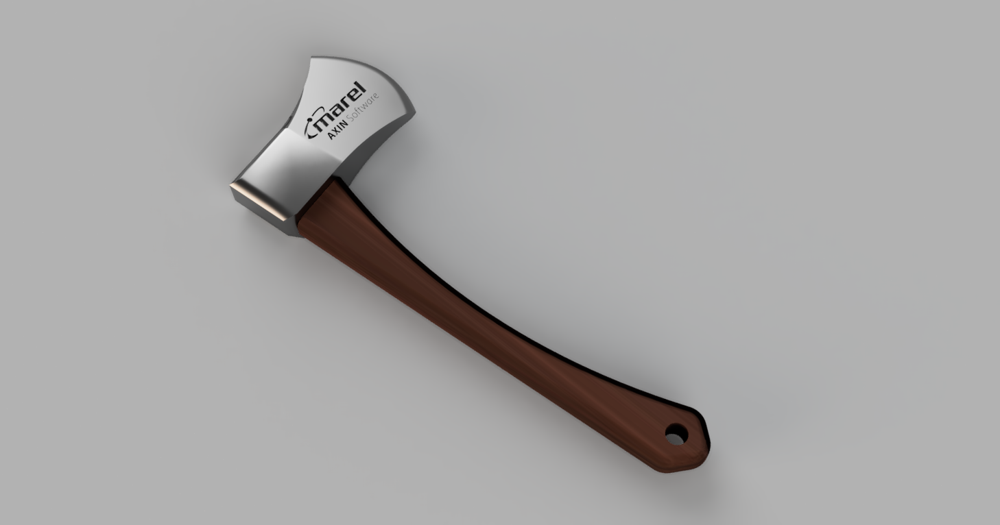
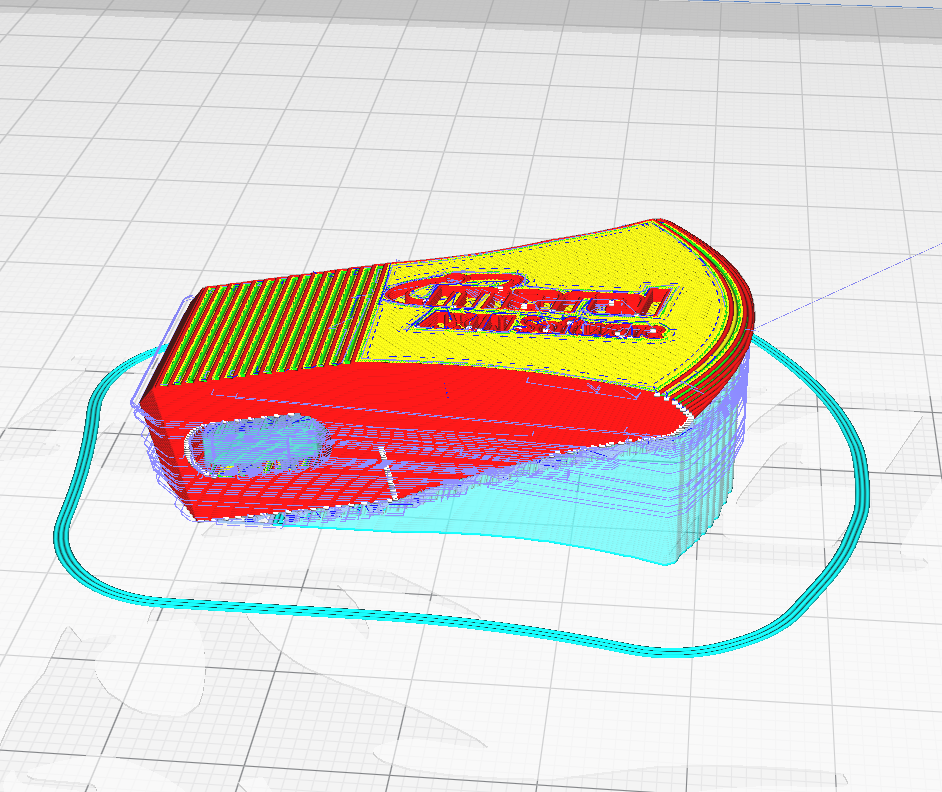

# Introduction

As a joke, i offered to make a printable 3d model of an axe with the axin logo on the official announcement of the Axin rebranding.

So here it is ; with an optional printable handle.

The model axe head is 5cm long by default, but can be scaled up to suit your purposes.

If you want to print the axe handle along with the head, make sure to scale it by the same factor!

You can also use the printed head with an actual axe handle, but that takes some measuring as the opening in the axe head will need to narrowly fit over your handle.

** WARNING **

Do NOT fabricate this model out of anything other than plastic unless taking serious safety precautions.

Even though i have blunted the edge of the blade significantly, it is potentially dangerous and capable of harm.

I repeat : **this is a model of an axe and it could be dangerous**
 

# Getting Started
1.	Clone this repo
2.	(optionally) acquire 3d printing hardware
3.	Configure your slicer
4.	Slice the model(s) for our printer
    For maximum readability and success, i'd like to suggest angling the model so that the surface with the text is fully horizontal.

    (here is an example in Cura: )

    

    **this does mean however** that you will need to print a bunch of support material in order to support the model as it prints (unless using a powder printer)
    
    Removing the support material will be a little bit of a hassle on the inside of the handle opening, but nothing ventured, nothing gained.
5.  Print the axe
6.  ????
7.  profit!

# Contribute
Make sure you are aware that the Marel and Axin logo are licensed trademarks of Marel HF so you don't break any laws.

Import the files into your favorite 3d modeling application

Go nuts!